[options="header"]
[cols="1, 3, 3"]
|===
|Version | Bearbeitungsdatum   | Autor 
|0.1	| bis 15.11.21 |

* Jorinde Wellmer

* Alexander Jurkin

* Jesse Pohl

* Muhammad Hanif A F

|===

= Entwicklerdokumentation

== Einführung und Ziele
* Aufgabenstellung

_Hinweis: Die Aufgabenstellung ist von der Sicht des Auftraggebers geschrieben._

Unsere Filiale "Pizza-Service Papa Pizza" liefert Pizzen und Getränke auf telefonische Bestellung an unsere Kunden aus. Ohne eine Software wäre diese Aufgabe undenkbar. Daher benötigen wir eine Software, diese soll 

* über eine Kundenliste verfügen
* eine Liste aller Bestellungen haben
* alle Zutaten, Getränke und Salate der Filiale anbieten können
* eine Liste aller Mitarbeiter besitzen

Da unsere Filiale schlechte Erfahrungen mit Telefonscherzen gemacht hat, dürfen nur noch Leute eine telefonische Bestellung machen, die im System registriert sind. Alle anderen müssen ihre erste Bestellung persönlich vor Ort machen. Dabei werden sie in das System integriert. Bei der Registrierung wird der Name, Vorname, die Adresse und seine Telefonnummer gespeichert. Bei der ersten persönlichen Bestellungen erhalten die Kunden ihre einzigartige TAN. Die TAN ist eine 6-stellige Nummer die niemals gleichzeitig doppelt sein kann, d.h. es dürfen nie 2 Kunden gleichzeitig die gleiche TAN haben. Bei einer telefonischen Bestellung werden dann die Telefonnummer und die dazugehörige TAN überprüft und nur wenn beides übereinstimmt kann der Kunde eine Bestellung aufnehmen. Dabei wird die TAN verbraucht und mit der Rechnung eine neue einzigartige TAN für diesen Kunden erstellt.

Natürlich gibt es einen Geschäftsleiter (Boss), dieser hat weitere Möglichkeiten, die ein Mitarbeiter nicht hat. Der Boss kann zusätzlich eine Liste der Mitarbeiter aufrufen, eine Liste des Inventars der Filiale und auch Informationen über dem Umsatz. Beim Reiter Inventar kann der Boss weitere Zutaten, Getränke oder Salate hinzufügen, die verkauft werden können. Außerdem kann er die aktuellen Preise der Zutaten, Getränke und Salate ändern und er kann die Öfenanzahl nach belieben einstellen. Im Reiter Umsatz kann der Boss den Umsatz pro Woche und auch pro Tag einsehen.

Es gibt 3 Rollen in der Filiale, jeder Mitarbeiter besitzt genau eine Rolle: 
Alle die, die die Rolle "Mitarbeiter" besitzen, können Bestellungen aufnehmen und fertigstellen. Normalerweise registrieren sie neue Kunden in das System und nehmen ihre Bestellungen auf.
Alle die, die die Rolle "Lieferbote" besitzen, können nur Bestellungen einsehen (die geliefert werden müssen), dabei können sie nur eine begrenzte Anzahl an Bestellungen annehmen. Wenn eine angenommene Bestellung ausgeliefert wird, können sie diese Bestellung abschließen, dadurch wird diese Bestellung als "abgeschlossen" angesehen und sie können wieder eine Bestellung annehmen. Maximal kann ein Lieferbote nur 10 Bestellungen gleichzeitig angenommen haben.
Der Boss besitzt die Rolle "Boss". Er kann alles was auch ein Mitarbeiter der Rolle "Mitarbeiter" und "Lieferbote" kann. Zusätzlich hat er drei weitere Reiter, um besser über der Filiale verwalten zu können.

* Qualitätsziele

Die folgenden Qualitätsziele beziehen sich aus dieser Quelle (https://iso25000.com/index.php/en/iso-25000-standards/iso-25010)

Wartungsmöglichkeiten::
Die Software soll sehr einfach gewartet werden können. Dabei sollen Fehler einfach korrigiert werden können oder Verbesserungen und Veränderungen einfach implementiert werden können.

Benutzerfreundlichkeit::
Die Software soll sehr einfach bedient werden können, ohne das der Mitarbeiter jegliche technische Grundlagen benötigt.

Leistungsfähigkeit::
Die Software soll effizient arbeiten. Dazu zählt die Zeiteffizienz und die Ressourceneffizienz.

Zuverlässigkeit::
Die Software soll immer zugänglich sein und keine error-Möglichkeiten bieten.

Die folgende Tabelle zeigt die Qualitätsziele und die dazugehörige Priorität. Dabei ist 1 = nicht wichtig und 5 = sehr wichtig.

[options="header", cols="4h, ^1, ^1, ^1, ^1, ^1"]
|===
|Qualitätsziel           | 1 | 2 | 3 | 4 | 5
|Wartungsmöglichkeiten   |   |   |   |   | x
|Benutzerfrendlichkeit   |   |   | x |   |
|Leistungsfähigkeit      |   |   |   | x |
|Zuverlässigkeit         |   |   |   |   | x
|===

== Randbedingungen
=== Hardware-Vorgaben
Eine Liste der benötigten Geräte / Hardware um dieses Programm starten und bedienen zu können:

* (Kasse)
* Computer
* Tastatur
* Maus

=== Software-Vorgaben
Es wird diese ( oder eine neuere ) Version von Java benötigt, um dieses Programm starten zu können:

* Java 11

=== Vorgaben zum Betrieb der Software
Diese Software wird ausschließlich nur von der Filiale "Pizza-Service Papa Pizza" benutzt und auch nur für diese Filiale programmiert.

Die Software soll der Filiale helfen einen Überblick über der Filiale zu behalten und Telefonscherzen aus dem Weg gehen zu können. Dieses Programm können nur Mitarbeiter der Firma benutzen, dabei werden keine technische Grundlagen vorrausgesetzt.

== Kontextabgrenzung

[[kontext_diagramm]]
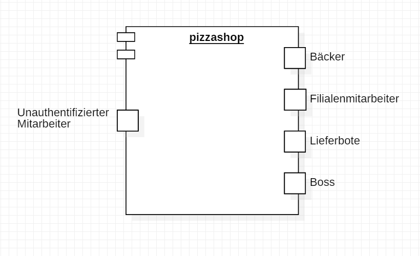

_Kontextdiagramm_

== Lösungsstrategie
=== Erfüllung der Qualitätsziele
[options="header"]
|=== 
|Qualitätsziel |Lösungsansatz
|Wartungsmöglichkeiten  a|
* *Isolierung der Komponenten*, sodass eine Änderung an der einen Komponente möglichst wenig Einfluss auf die anderen Komponenten hat.
* *Wiederverwendbarkeit* der Komponenten in anderen systemem oder Komponenten.
* *Modifizierbarkeit*, sodass das Programm modifiziert werden kann, ohne das es weitere errors generiert oder die Produktqualität dadurch sinkt.
|Benutzerfreundlichkeit  a|
* *Erlernbarkeit* des Programmes, es sollen andere Arbeiter dieses Programm schnell verstehen und damit arbeiten können. Dies erreicht man durch eindeutiges beschreiben der Labels oder Tooltips
* *Handhabung der errors*, die Benutzer sollen im besten Fall keine errors erzeugen können. Dabei sollen z.B. falsche Eingaben nicht dafür sorgen, dass sich das Programm beendet durch errors
* *Interface Asthetik* es soll ein sehr einfaches und zufriedenstellendes grafisches Interface geben.
|Leistungsfähigkeit a|
* *Zeit-Effizienz* das Programm soll sehr effizient sein, d.h. es soll schnell arbeiten können, zu erreichen durch gut durchdachten Code.
* *Ressourcen-Effizienz* das Programm soll auch mit wenig Ressourcen gut arbeiten können.
|Zuverlässigkeit a|
* *Error-Vermeidung* das Programm soll zu jeder Zeit immer laufbereit sein, es sollen möglichst wenig (im besten Fall keine) error-Meldungen erscheinen.
|===

=== Softwarearchitektur
* Beschreibung der Architektur anhand der Top-Level-Architektur oder eines Client-Server-Diagramms

[[Component_diagramm]]
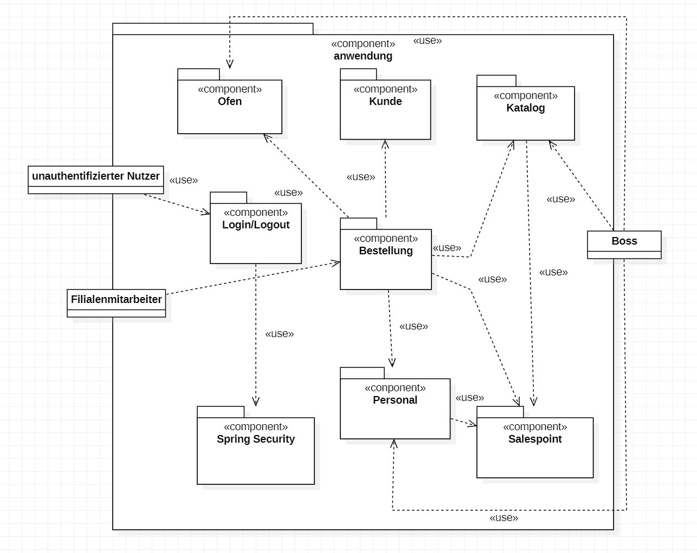
_Top-Level-Architektur_

[[ClientServer_diagramm]]
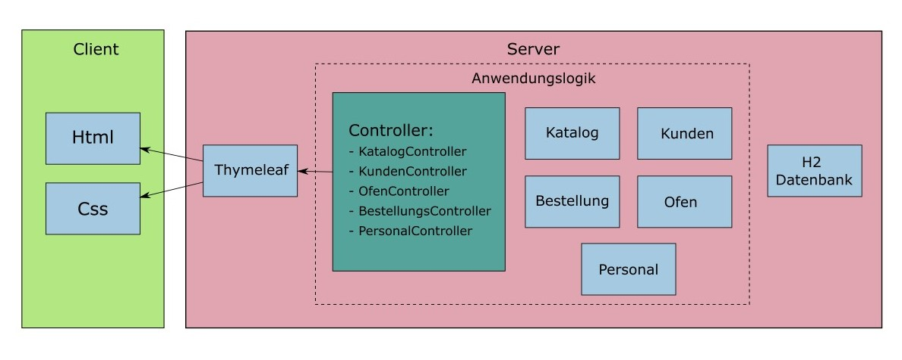
_Client-Server Diagramm_

=== Entwurfsentscheidungen
* Persistenz

  Es soll Spring Data JPA genutzt werden, um schnell auf Daten zugreifen zu können.

* Benutzeroberfläche
[[Dialogmap_diagramm]]
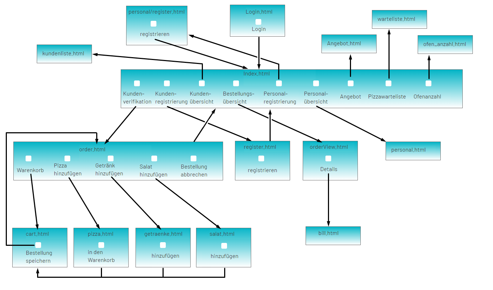
_Dialogkarte_

=== Verwendung externer Frameworks

[options="header", cols="1,2"]
|===
|Externes Package |Verwendet von (Klasse der eigenen Anwendung)
|salespointframework.core a|
* Kunde.KundeInitializer
* personal.PersonalDataInitializer
|salespointframework.useraccount a|
* personal.Personal
* personal.PersonalDataInitializer
* personal.LieferboteManagement
* personal.MitarbeiterManagement
|salespointframework.SalespointSecurityConfiguration a|
* pizzashop.WebSecurityConfiguration
|springframework.boot a|
* pizzashop.application
|springframework.data a|
* Kunde.KundenManagement
* Kunde.KundenEinträge
* personal.LieferboteManagement
* personal.LieferboteRepository
* personal.MitarbeiterManagement
* personal.MitarbeiterRepository
* katalog.BestellKatalog
|springframework.security a|
* pizzashop.WebSecurityConfiguration
|springframework.ui a|
* Kunde.KundenController
* katalog.KatalogController
* pizzashop.order.OrderController
|springframework.util a|
* Kunde.KundenController
* Kunde.KundenInitializer
* personal.PersonalDataInitializer
* personal.LieferboteManagement
* personal.MitarbeiterManagement
* katalog.KatalogController
* katalog.KatalogDataInitializer
* pizzashop.order.OrderController
|springframework.validation a|
* Kunde.KundenController
* katalog.NeueBestelleinheitForm
* katalog.KatalogController
|springframework.web a|
* pizzashop.PizzaShopWebConfiguration
* pizzashop.order.OrderController
|salespointframework.catalog a|
* katalog.Bestelleinheit
* katalog.BestellKatalog
|javamoney.moneta.Money a|
* katalog.Bestelleinheit
* katalog.KatalogDataInitializer
* katalog.NeueBestelleinheitForm
|util.ArrayList a|
* katalog.pizza
||

|===

== Bausteinsicht
* Entwurfsklassendiagramme der einzelnen Packages

=== Kunde
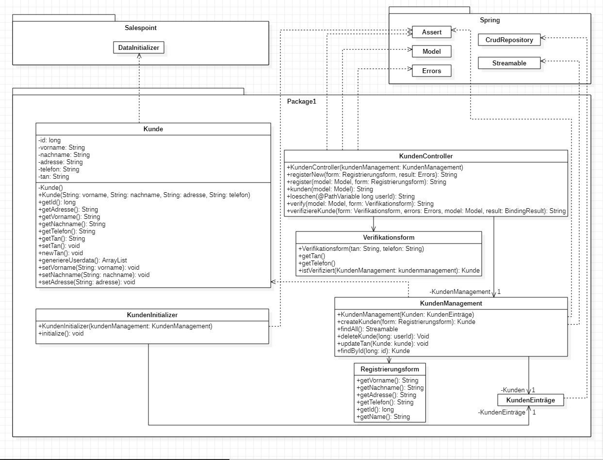
_Klasse-Kunde Diagramm_

[options="header"]
|===
|Klasse/Enumeration |Beschreibung
|Kunden |Klasse für den Kunden mit Vorname, Nachname, Adresse, Telefonnummer
|KundenController |Spring Controller um Kunden zu registrieren und anzuzeigen
|KundenInitializer | Eine Implementation, um selbst generierte Kunden zeigen zu können
|KundenManagement | Klasse um über Kunden verwalten zu können
|KundenEinträge | Eine Schnittstelle um Kundeninstanzen verwalten zu können
|Registrierungsform | Ein Formular um die Daten der Registrierung zu validieren
|===

=== Personal

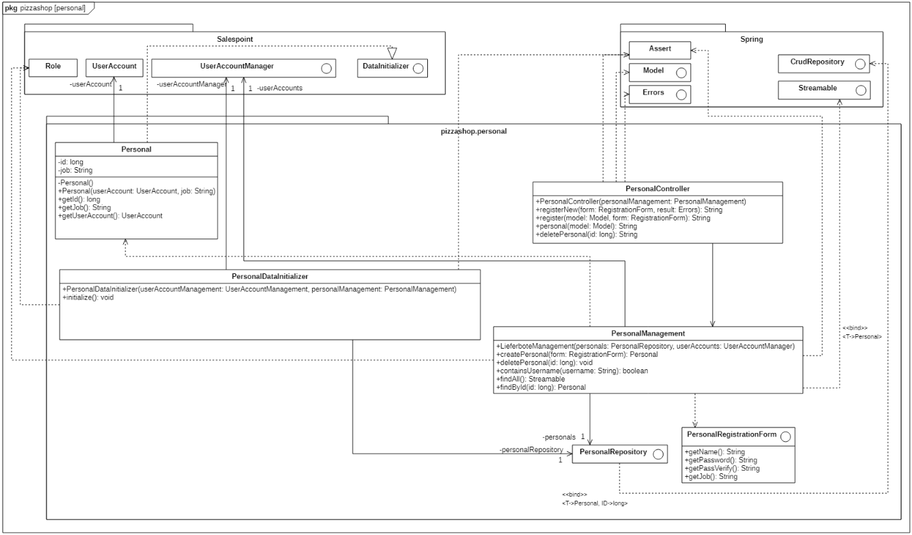
_Klasse-Personal Diagramm_

[options="header"]
|=== 
|Klasse/Enumeration |Beschreibung
|Personal|Klasse, um Salespoint-UserAccount mit einem hinzugefügten Attribut, nämlich job, zu erweitern
|PersonalController |Spring MVC Controller um Personal zu registrieren und anzuzeigen
|PersonalDataInitializer | Eine Implementation von DataInitializer, um Standardbenutzer zu generieren
|PersonalRepository | Eine Schnittstelle, um Personal-Instanzen zu verwalten
|PersonalManagement | Service-Klasse, um über Personal zu verwalten
|PersonalRegistrationForm | Ein Formular um die Daten der Registrierung des Personals zu validieren
|===

=== Katalog

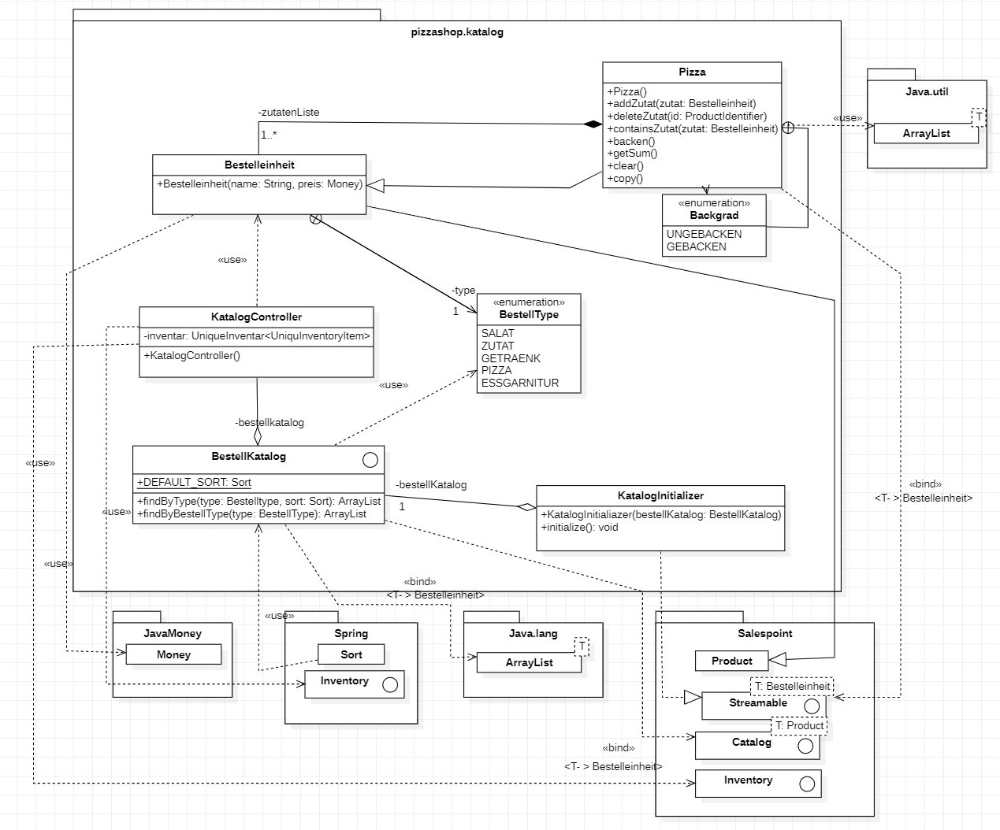
_Klasse-Angebot Diagramm_

[options="header"]
|===
|Klasse/Enumeration |Beschreibung
|Bestelleinheit |Klasse für Bestellungsbestandteile, die von Salespoint.Produkt erbt
|BestellType | Enumeration um zwischen Bestellungseinheiten zu unterscheiden
|Zutat | Kindklasse von Bestelleinheit, die Zutaten repräsentiert mit name und preis
|Pizza | Kindklasse von Bestelleinheit, die zusätzlich Liste von Zutaten erhält
|BestellKatalog | Erweiterung des Salespoint.Catalog, um Bestelleinheiten verwalten zu können
|KatalogController | Spring MVC Controller um neue Bestelleinheiten hinzuzufügen und anzuzeigen
|KatalogDataInitializer | Implementierung von DataInitializer, um probeweise Bestelleinheiten zu generieren
|NeueBestelleinheitForm | Ein Formular um die Daten einer neuen Bestelleinheit zu validieren und zu übertragen
|===

=== Bestellung

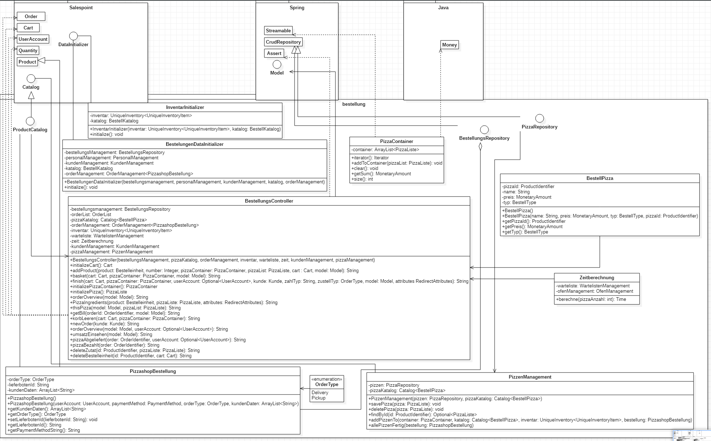

_Klasse-Bestellung Diagramm_

[options="header"]
|===
|Klasse/Enumeration/Interface |Beschreibung
|ProductCatalog | Interface für PizzashopProducts basierend auf Catalog (Salespoint)
|PizzashopProduct | Klasse, die von Product (Salespoint) erbt
|ProductType | Enumeration für PizzashopProducts
|OrderController | Spring MVC Controller um Bestellungen zu erstellen
|CustomerInfo | Kundeninformationen für Bestellungen
|Pizza | Pizza bestehend aus Ingredients und Teil von Bestellungen
|Ingredients | Zutaten für Pizza
|UserDataInitializer | initialisiert Benutzer mit Hilfe von DataInitializer (Salespoint)
|ProductDataInitializer | initialisiert Standardprodukte mit Hilfe von DataInitializer (Salespoint)
|===

=== Rückverfolgbarkeit zwischen Analyse- und Entwurfsmodell
_Die folgende Tabelle zeigt die Rückverfolgbarkeit zwischen Entwurfs- und Analysemodell. Falls eine Klasse aus einem externen Framework im Entwurfsmodell eine Klasse des Analysemodells ersetzt,
wird die Art der Verwendung dieser externen Klasse in der Spalte *Art der Verwendung* mithilfe der folgenden Begriffe definiert:_

* Inheritance/Interface-Implementation
* Class Attribute
* Method Parameter

[options="header"]
|===
|Klasse/Enumeration (Analysemodell) |Klasse/Enumeration (Entwurfsmodell) |Art der Verwendung
|Bestellungsbestandteil                 a|
						* katalog.Bestelleinheit |
|Salat/Getränk                    a|
						* katalog.Bestelleinheit
						* katalog.Bestelleinheit.BestellType |
|Zutat                    a|
						* katalog.Bestelleinheit
						* katalog.Zutat |Inheritance/Interface-Implementation

|Essgarnitur                    a|
						* katalog.Bestelleinheit
						* katalog.Bestelleinheit.BestellType |

|AngebotsManagement              a|
            * katalog.bestellKatalog
            * katalog.katalogController|
|Pizzashop              |pizzashop.PizzaShop |
|Kunde a|	* kunde.kunde 	a|* Klassenattribut
				  * Methodenparameter
|ROLE/Role              |Salespoint.Role | Method Parameter
|Personal                   a|
						* Salespoint.UserAccount
						* personal.Personal a|
						* Class Attribute
						* Method Parameter
|Bestellung	a|* pizzashop.order.OrderController	a| Inheritance/Interface-Implementation

|===

== Laufzeitsicht
* Darstellung der Komponenteninteraktion anhand eines Sequenzdiagramms, welches die relevantesten Interaktionen darstellt.

=== Kunde
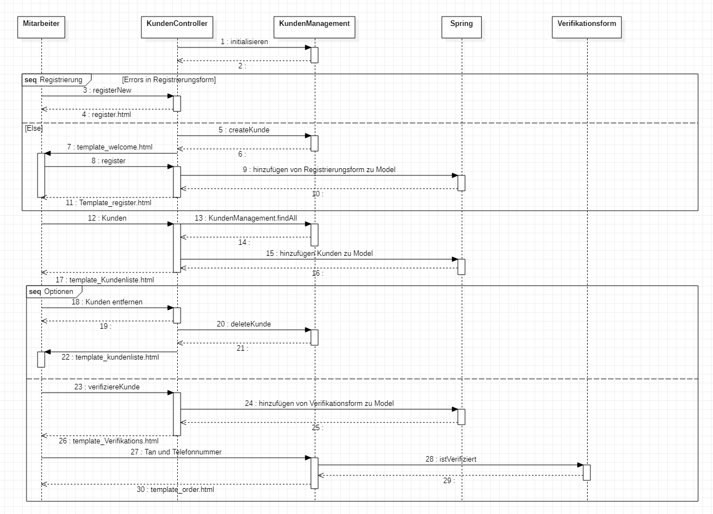
_Sequenz-Kunde Diagramm_

=== Angebot
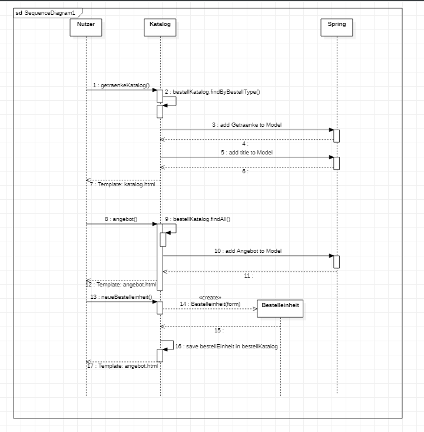

_Sequenz-Angebot Diagramm_

=== Personal
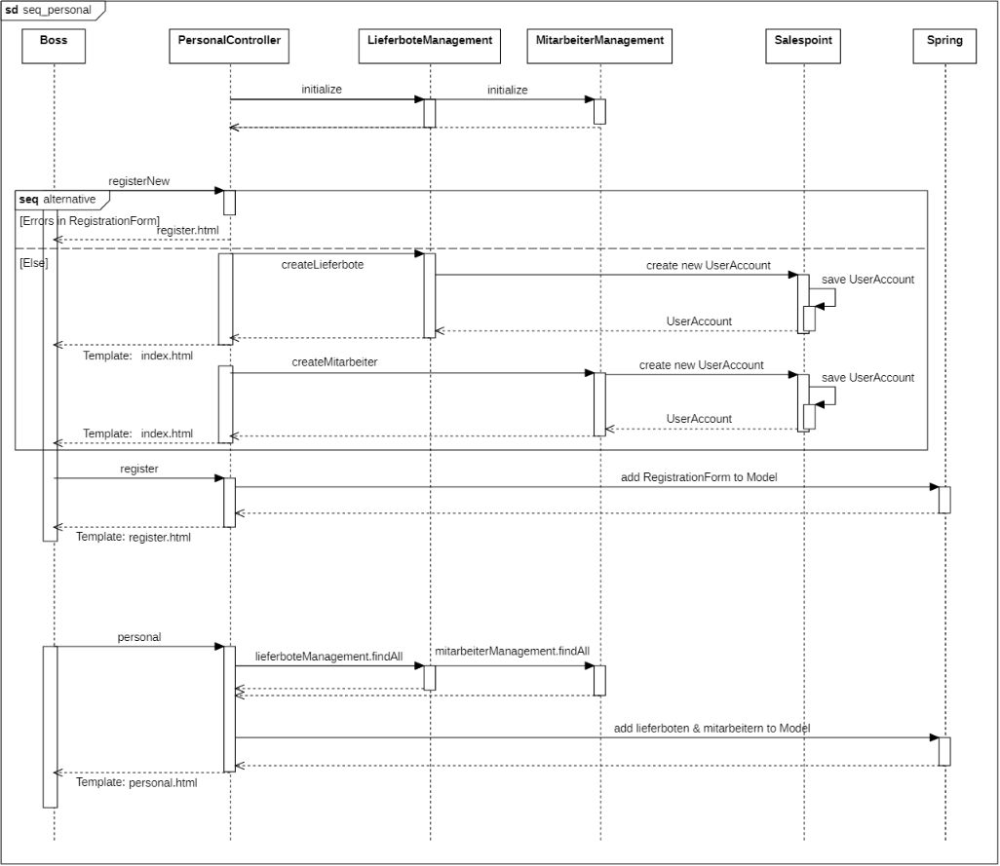
_Sequenz-Personal_

=== Bestellung
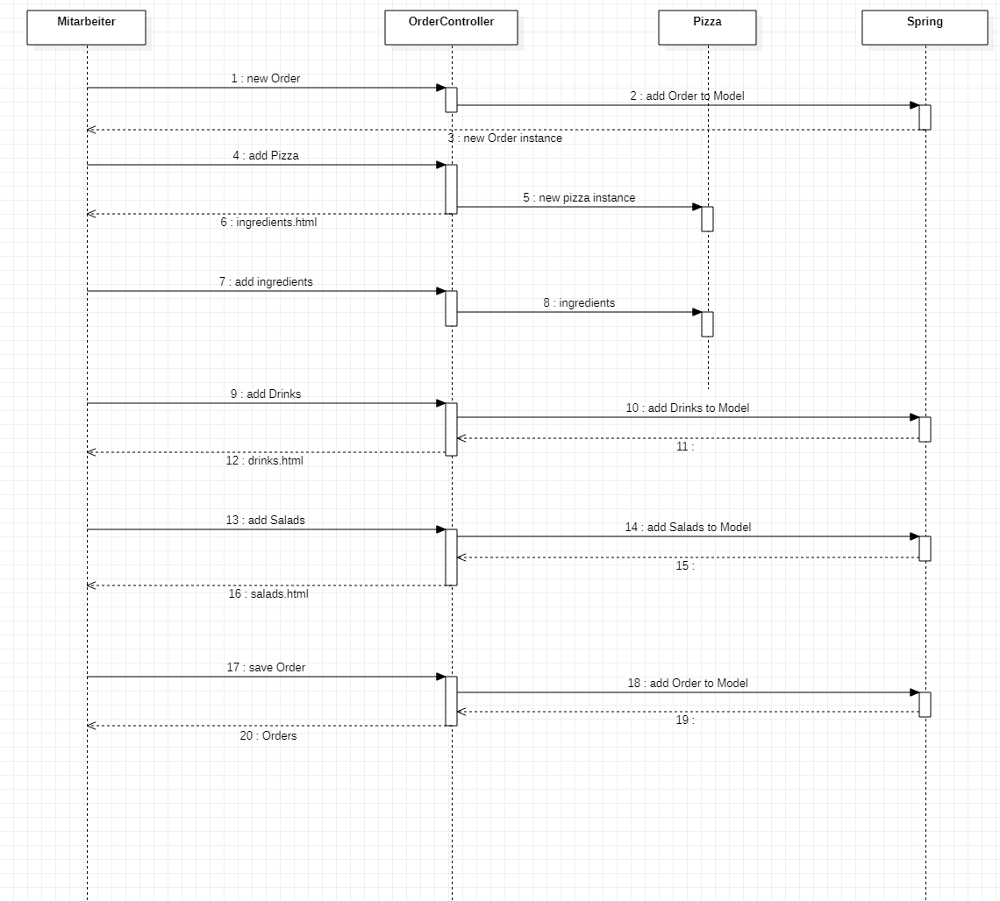
_Sequenz-Bestellung Diagramm_

== Schulden
* Auflistung der nicht erreichten Quality Gates und der zugehörigen SonarQube Issues zum Zeitpunkt der Abgabe

